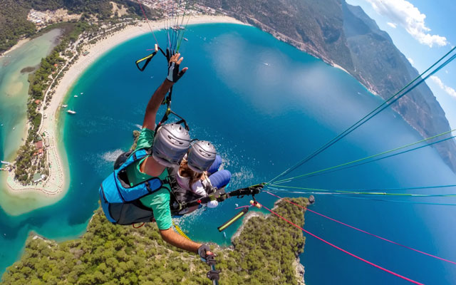
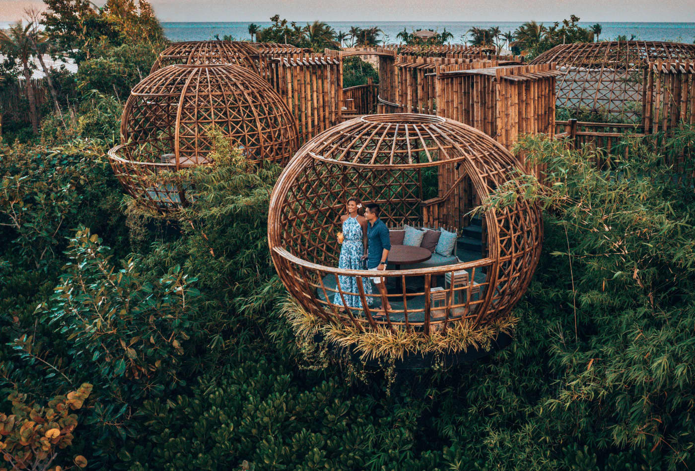
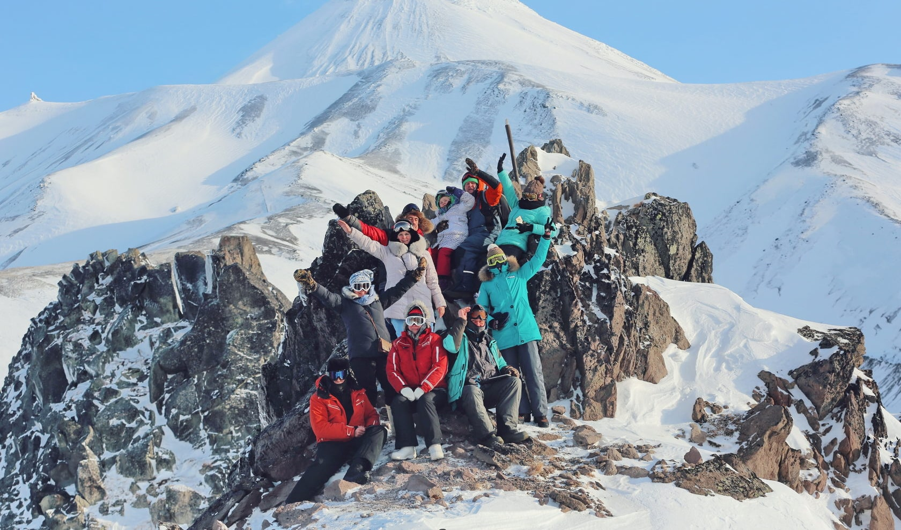

# travel-agency
Skip to content
Search or jump to…

Pull requests
Issues
Marketplace
Explore
 
@rahmanzayed 
Learn Git and GitHub without any code!
Using the Hello World guide, you’ll start a branch, write comments, and open a pull request.

rahmanzayed
/
travel-agency
1
00
Code
Issues
Pull requests
Actions
Projects
Wiki
Security
Insights
Settings
travel-agency/index.html
@rahmanzayed
rahmanzayed Add files via upload
Latest commit c56da84 26 seconds ago
 History
 1 contributor
73 lines (62 sloc)  4.08 KB
  
<!DOCTYPE html >
<html>
<head>
	<title>SHEZAN SRD/RAHMAN ZAYED</title>
	<link rel="stylesheet" type="text/css" href="style.css" />
</head>

<body>

  

   	
<a href="#">Home</a>

		  
<a href="#">About</a>

		  
<a href="#">travel</a>

		  
<a href="#">Services</a>

		  
<a href="#">Contact</a>

	

  

    
Holiday Agency 

    
winter vacation 

  

  

  
    <h1 class="contentTitle">This winter vacation</h1>
	
    

      
Adventure.Travel is the go-to source for information on adventure travel that prioritizes sustainability, serves as a force for good, and transforms people and places. From research and trends to best travel practices, ideal gear, and destinations and operators with outstanding commitments to responsible travel, we have everything you need to make sure your adventures align with your values. 

       
	  
Lorem Ipsum is simply dummy

      
Life-changing travel must also be sustainable travel. By bringing together a growing community of people committed to traveling thoughtfully and considerately, we help shape the adventure and eco-tourism industry as it grows. In response to travelers’ desires, tour operators, destinations and travel advisors are increasingly working to ensure their experiences provide an unforgettable journey in a responsible, sustainable way. Such commitment in turn honors the people, environment and economies of incredible destinations around the world.Through compelling images and well-crafted stories, research and curated news of interest, Adventure.Travel inspires the curious to try new destinations, branch out in their activities, interact deeply with nature, and experience different cultures in the most respectful way possible.

       
      
  
    

	  

     
	   
	  <h1 class="contentTitle" style="margin-bottom:20px;">About Skydiving </h1>
		 

			Skydiving is an incredibly exciting adrenaline fueled sport that tens of thousands of people across the world enjoy every year.
			The sheer volume of skydives that happen across the world means that we have tons of data to show that while the sport has risks, it can be done safely. The USPA (United States Parachute Association) has statistics about how many people jump and how many have problems along the way – we’ll come to this in a bit.Essentially, skydiving is as safe as it can be. It sounds like a fluffy answer, but we have so many precautions in place to reduce risk that for many, the risk quotient is manageable.
		

       
      
  
    

  

  

  
	 <h1 class="sidetile">HONEYMOON TRIP</h1>
      
The point of the Maldives is that it is not a single large island but is, instead, a collection of thousands of tiny coral islands. ... Each island is surrounded by a lagoon of shallow water (though the Indian Ocean, with its deep blue water, lies beyond). It is the clearest water you will ever see. 

       
  

  
	 <h1 class="sidetile">Winter family trips</h1>
      
When the cold weather sets in, so does cabin fever. Looking for a reason to get out of the house? We’ve got some great winter family vacation ideas, from warm-weather escapes in the Caribbean to indoor amusements closer to home. These are the best winter family vacations for 2021

       
  

<footer>
  
shezan tour agency 
  <a href="www.fcebook.com">shezan's travelagency.com</a>

</footer>
</body>
</html>
© 2021 GitHub, Inc.
Terms
Privacy
Security
Status
Docs
Contact GitHub
Pricing
API
Training
Blog
About
